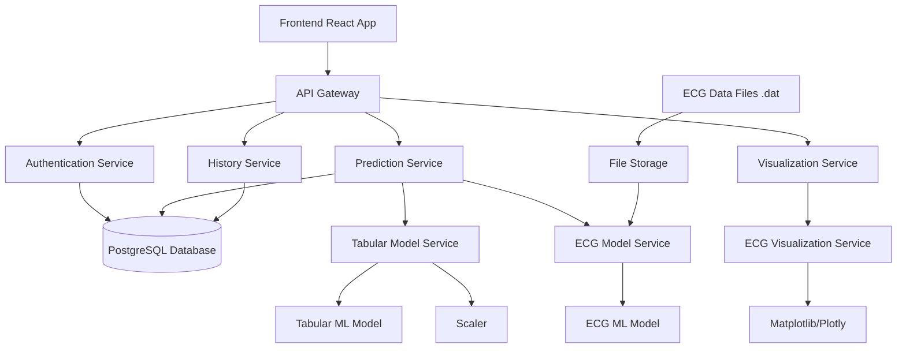

# Cardiovascular Disease Prediction - Backend Architecture

## Overview
This document outlines the backend architecture for serving the machine learning models for cardiovascular disease prediction, including both tabular data and ECG signal analysis.

## Technology Stack
- **Framework**: FastAPI (Python) - Modern, fast web framework with automatic API documentation
- **ML Libraries**: TensorFlow/Keras for ECG model, Scikit-learn for tabular model
- **Database**: PostgreSQL for storing predictions and user data
- **File Storage**: Local storage for ECG files with potential cloud storage integration
- **Visualization**: Matplotlib/Plotly for ECG signal visualization
- **Deployment**: Docker containers with Docker Compose for orchestration

## System Architecture

## Services Breakdown

### 1. Authentication Service
- User registration and login
- JWT token generation and validation
- Session management

### 2. Prediction Service
#### Tabular Model Service
- Accepts patient data (age, gender, blood pressure, etc.)
- Preprocesses data using the saved scaler
- Loads and runs the tabular model (best_tabular_model.pkl)
- Returns prediction with confidence score
- Provides feature importance explanation

#### ECG Model Service
- Accepts ECG data files (.dat format)
- Processes ECG signals for model input
- Loads and runs the ECG model (best_ecg_model.h5)
- Returns arrhythmia detection with confidence score
- Provides detailed classification explanation

### 3. Visualization Service
- ECG signal plotting and visualization
- Interactive charts for detailed analysis
- Export capabilities (PNG, PDF)

### 4. History Service
- Stores prediction results
- Maintains user history
- Provides analytics and trends

## Data Flow

1. User submits data through frontend
2. API gateway routes request to appropriate service
3. Authentication service validates user
4. Prediction service processes data:
   - Tabular: Apply scaling → Run model → Generate explanation
   - ECG: Process signal → Run model → Generate visualization
5. Results stored in database
6. Response sent back to frontend with:
   - Prediction result
   - Confidence score
   - Explanation/description
   - Visualization (for ECG)

## Model Integration Details

### Tabular Model (best_tabular_model.pkl)
- Input features: age, gender, height, weight, ap_hi, ap_lo, cholesterol, gluc, smoke, alco, active
- Output: Probability of cardiovascular disease
- Additional outputs: Feature importance for explanation

### ECG Model (best_ecg_model.h5)
- Input: Processed ECG signals
- Output: Classification probabilities for different arrhythmias
- Additional outputs: Attention weights for signal highlighting

### Scaler (tabular_scaler.pkl)
- Used to normalize tabular input data before prediction