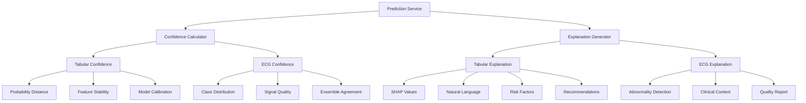

# Confidence Scoring and Explanation System

## Overview
This document outlines the design of the confidence scoring and explanation system for the cardiovascular disease prediction application, covering both tabular data and ECG signal predictions.

## Confidence Scoring Framework

### Tabular Model Confidence
For the tabular model (best_tabular_model.pkl), confidence is determined by:

1. **Prediction Probability Distance**
   - For binary classification, confidence = |0.5 - probability| * 2
   - Higher distance from 0.5 indicates higher confidence

2. **Feature Stability**
   - Measure how much prediction changes with small perturbations
   - Lower variability = higher confidence

3. **Model Calibration**
   - Compare predicted probabilities with actual outcomes in validation set
   - Well-calibrated models produce more reliable confidence scores

### ECG Model Confidence
For the ECG model (best_ecg_model.h5), confidence is determined by:

1. **Class Probabilities Distribution**
   - Confidence = max(class_probabilities)
   - Sharp distribution (one high probability) = high confidence
   - Flat distribution (similar probabilities) = low confidence

2. **Signal Quality Metrics**
   - Noise level assessment
   - Baseline drift evaluation
   - Artifact detection

3. **Ensemble Agreement**
   - If using ensemble methods, agreement between models
   - Higher agreement = higher confidence

## Explanation System Design

### Tabular Prediction Explanations

#### Feature Importance Explanation
- **Method**: SHAP (SHapley Additive exPlanations) values
- **Implementation**:
  ```python
  explainer = shap.Explainer(model.predict, X_sample)
  shap_values = explainer(input_data)
  ```

#### Natural Language Summary
- **Template-Based Generation**:
  ```
  Based on the patient data, there is a {risk_level} risk of cardiovascular disease 
  with {confidence_percentage}% confidence. Key contributing factors include 
  {top_factors}. {recommendations}
  ```

#### Risk Factor Analysis
- **Positive Contributors**: Factors increasing risk
- **Protective Factors**: Factors decreasing risk
- **Magnitude**: Relative impact of each factor

#### Personalized Recommendations
- **Lifestyle Changes**: Diet, exercise, smoking cessation
- **Medical Follow-up**: Specialist consultation, monitoring frequency
- **Medication**: When appropriate, suggest discussing with physician

### ECG Prediction Explanations

#### Abnormality Detection Explanation
- **Localization**: Time points where abnormalities detected
- **Classification**: Type of arrhythmia with confidence levels
- **Morphology Analysis**: Waveform characteristics supporting diagnosis

#### Clinical Context
- **Prevalence Information**: How common the condition is
- **Severity Assessment**: Potential health impact
- **Treatment Options**: General treatment approaches

#### Signal Quality Report
- **Noise Assessment**: Signal-to-noise ratio
- **Artifact Detection**: Movement artifacts, electrical interference
- **Recording Duration**: Sufficient for analysis

## Implementation Architecture



## Detailed Implementation

### Confidence Calculation Methods

#### Tabular Confidence Algorithm
```python
def calculate_tabular_confidence(prediction_proba, model, input_data):
    # Primary confidence from prediction probability
    primary_confidence = abs(0.5 - prediction_proba) * 2
    
    # Feature stability check
    stability_score = calculate_feature_stability(model, input_data)
    
    # Combined confidence
    final_confidence = (primary_confidence * 0.7) + (stability_score * 0.3)
    
    return final_confidence
```

#### ECG Confidence Algorithm
```python
def calculate_ecg_confidence(class_probabilities, signal_quality):
    # Primary confidence from class probabilities
    primary_confidence = max(class_probabilities)
    
    # Adjust for signal quality
    adjusted_confidence = primary_confidence * signal_quality
    
    return adjusted_confidence
```

### Explanation Generation

#### Tabular Explanation Structure
```json
{
  "summary": "High risk of cardiovascular disease (85% probability)",
  "confidence": 0.92,
  "key_factors": [
    {
      "feature": "Systolic Blood Pressure",
      "value": 160,
      "impact": "High",
      "direction": "increase_risk"
    },
    {
      "feature": "Physical Activity",
      "value": "Yes",
      "impact": "Medium",
      "direction": "decrease_risk"
    }
  ],
  "recommendations": [
    "Consult with a cardiologist for comprehensive evaluation",
    "Monitor blood pressure regularly",
    "Maintain current physical activity level"
  ]
}
```

#### ECG Explanation Structure
```json
{
  "summary": "Arrhythmia detected - Premature Ventricular Contractions",
  "confidence": 0.87,
  "findings": [
    {
      "type": "PVC",
      "count": 12,
      "frequency": "Occasional",
      "clinical_significance": "Generally benign but should be monitored"
    }
  ],
  "signal_quality": {
    "overall": "Good",
    "issues": []
  },
  "recommendations": [
    "Follow up with cardiologist for detailed evaluation",
    "Consider 24-hour Holter monitoring",
    "Avoid excessive caffeine and alcohol"
  ]
}
```

## Integration with Existing Models

### Tabular Model Integration
1. **SHAP Integration**:
   - Load trained model (best_tabular_model.pkl)
   - Create SHAP explainer with sample data
   - Generate explanations for each prediction

2. **Confidence Enhancement**:
   - Use saved scaler (tabular_scaler.pkl) for consistent preprocessing
   - Apply same transformations for confidence calculations

### ECG Model Integration
1. **Prediction Probabilities**:
   - Extract class probabilities from model output
   - Use softmax activation for confidence calculation

2. **Attention Mechanisms**:
   - If model has attention layers, use for explanation visualization
   - Highlight important segments in ECG signal

## User Interface Considerations

### Confidence Display
- **Visual Indicators**: Progress bars, color coding (green=high, red=low)
- **Numerical Values**: Percentage confidence scores
- **Qualitative Descriptions**: "High", "Medium", "Low" confidence levels

### Explanation Presentation
- **Hierarchical Structure**: Summary first, details expandable
- **Visual Aids**: Charts, diagrams for feature importance
- **Actionable Items**: Clear recommendations with next steps

## Validation and Testing

### Confidence Calibration
- **Reliability Diagrams**: Compare predicted vs. actual confidence
- **Expected Calibration Error**: Quantitative measure of calibration quality

### Explanation Quality
- **Human Evaluation**: Clinician review of explanations
- **Consistency Checks**: Similar cases should have similar explanations
- **Faithfulness Tests**: Explanations should reflect actual model behavior

## Future Enhancements

### Advanced Confidence Methods
- **Bayesian Approaches**: Uncertainty quantification
- **Monte Carlo Dropout**: Epistemic uncertainty estimation
- **Conformal Prediction**: Rigorous uncertainty bounds

### Enhanced Explanations
- **Counterfactuals**: "What if" scenario analysis
- **Prototypes**: Similar cases from training data
- **Causal Reasoning**: Beyond correlation to causation