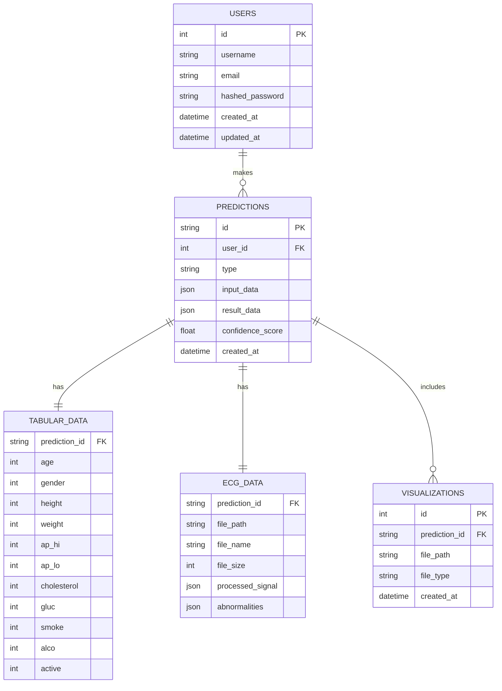

# Database Schema for Cardiovascular Disease Prediction

## Overview
This document defines the database schema for storing user accounts, prediction results, and related data for the cardiovascular disease prediction system.

## Entity Relationship Diagram



## Table Definitions

### Users Table
Stores user account information

| Column Name | Data Type | Constraints | Description |
|-------------|-----------|-------------|-------------|
| id | SERIAL | PRIMARY KEY | Unique user identifier |
| username | VARCHAR(50) | UNIQUE, NOT NULL | User's chosen username |
| email | VARCHAR(100) | UNIQUE, NOT NULL | User's email address |
| hashed_password | VARCHAR(100) | NOT NULL | Hashed password |
| created_at | TIMESTAMP | DEFAULT NOW() | Account creation timestamp |
| updated_at | TIMESTAMP | DEFAULT NOW() | Last update timestamp |

### Predictions Table
Stores all prediction results

| Column Name | Data Type | Constraints | Description |
|-------------|-----------|-------------|-------------|
| id | UUID | PRIMARY KEY | Unique prediction identifier |
| user_id | INTEGER | FOREIGN KEY (users.id) | Reference to user |
| type | VARCHAR(20) | NOT NULL | Prediction type: 'tabular' or 'ecg' |
| input_data | JSON | NOT NULL | Original input data |
| result_data | JSON | NOT NULL | Complete prediction result |
| confidence_score | FLOAT | NOT NULL | Confidence level (0.0 - 1.0) |
| created_at | TIMESTAMP | DEFAULT NOW() | Prediction creation timestamp |

### TabularData Table
Stores normalized tabular input data for easier querying

| Column Name | Data Type | Constraints | Description |
|-------------|-----------|-------------|-------------|
| prediction_id | UUID | PRIMARY KEY, FOREIGN KEY (predictions.id) | Reference to prediction |
| age | INTEGER | NOT NULL | Age in years |
| gender | INTEGER | NOT NULL | Gender (1: Male, 2: Female) |
| height | INTEGER | NOT NULL | Height in cm |
| weight | INTEGER | NOT NULL | Weight in kg |
| ap_hi | INTEGER | NOT NULL | Systolic blood pressure |
| ap_lo | INTEGER | NOT NULL | Diastolic blood pressure |
| cholesterol | INTEGER | NOT NULL | Cholesterol level (1-3) |
| gluc | INTEGER | NOT NULL | Glucose level (1-3) |
| smoke | INTEGER | NOT NULL | Smoking habit (0: No, 1: Yes) |
| alco | INTEGER | NOT NULL | Alcohol consumption (0: No, 1: Yes) |
| active | INTEGER | NOT NULL | Physical activity (0: No, 1: Yes) |

### EcgData Table
Stores ECG file metadata and processed data

| Column Name | Data Type | Constraints | Description |
|-------------|-----------|-------------|-------------|
| prediction_id | UUID | PRIMARY KEY, FOREIGN KEY (predictions.id) | Reference to prediction |
| file_path | TEXT | NOT NULL | Path to uploaded ECG file |
| file_name | VARCHAR(100) | NOT NULL | Original file name |
| file_size | INTEGER | NOT NULL | File size in bytes |
| processed_signal | JSON | | Processed ECG signal data |
| abnormalities | JSON | | Detected abnormalities with timestamps |

### Visualizations Table
Stores visualization file references

| Column Name | Data Type | Constraints | Description |
|-------------|-----------|-------------|-------------|
| id | SERIAL | PRIMARY KEY | Unique visualization identifier |
| prediction_id | UUID | FOREIGN KEY (predictions.id) | Reference to prediction |
| file_path | TEXT | NOT NULL | Path to visualization file |
| file_type | VARCHAR(20) | NOT NULL | File type (png, pdf, etc.) |
| created_at | TIMESTAMP | DEFAULT NOW() | Visualization creation timestamp |

## Indexes

### Performance Indexes
```sql
-- For faster user lookups
CREATE INDEX idx_users_email ON users(email);
CREATE INDEX idx_users_username ON users(username);

-- For faster prediction queries
CREATE INDEX idx_predictions_user_id ON predictions(user_id);
CREATE INDEX idx_predictions_type ON predictions(type);
CREATE INDEX idx_predictions_created_at ON predictions(created_at);

-- For tabular data analysis
CREATE INDEX idx_tabular_age ON tabular_data(age);
CREATE INDEX idx_tabular_gender ON tabular_data(gender);
CREATE INDEX idx_tabular_cholesterol ON tabular_data(cholesterol);
CREATE INDEX idx_tabular_smoke ON tabular_data(smoke);
```

## Sample Queries

### Get user's recent predictions
```sql
SELECT p.id, p.type, p.result_data, p.confidence_score, p.created_at
FROM predictions p
WHERE p.user_id = %s
ORDER BY p.created_at DESC
LIMIT 10;
```

### Get average confidence by prediction type
```sql
SELECT type, AVG(confidence_score) as avg_confidence
FROM predictions
GROUP BY type;
```

### Get tabular predictions with high risk
```sql
SELECT p.id, t.age, t.gender, p.confidence_score, p.created_at
FROM predictions p
JOIN tabular_data t ON p.id = t.prediction_id
WHERE p.type = 'tabular' 
AND p.result_data->>'risk_level' = 'High Risk'
ORDER BY p.created_at DESC;