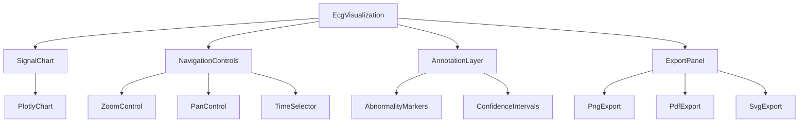

# ECG Visualization Component Plan

## Overview
This document outlines the design and implementation plan for ECG signal visualization components in the cardiovascular disease prediction system.

## Visualization Requirements

### Core Features
1. **Signal Display**: Render ECG waveform data as a line chart
2. **Time Navigation**: Pan and zoom functionality for detailed inspection
3. **Abnormality Highlighting**: Visually mark detected abnormalities with annotations
4. **Multi-lead Support**: Display multiple ECG leads if available
5. **Export Options**: Save visualizations as PNG, PDF, or SVG

### Technical Specifications
- **Library**: Plotly.js for interactive charts with React integration
- **Performance**: Optimize rendering for large datasets (minutes of ECG data)
- **Responsiveness**: Adapt to different screen sizes and orientations
- **Accessibility**: Support keyboard navigation and screen readers

## Component Architecture



## Component Details

### 1. EcgVisualization (Main Container)
**Props:**
- `ecgData`: Processed ECG signal data
- `abnormalities`: Array of detected abnormalities
- `predictionId`: Reference to prediction for exports

**State:**
- `zoomLevel`: Current zoom level
- `timeWindow`: Current time window (start, end)
- `selectedLead`: Currently displayed lead (if multi-lead)

### 2. SignalChart
**Props:**
- `signalData`: Time-series ECG data points
- `timeWindow`: Current display window
- `markers`: Abnormality markers to overlay

**Features:**
- Interactive line chart with time on x-axis and amplitude on y-axis
- Real-time rendering updates when time window changes
- Hover tooltips showing exact values

### 3. NavigationControls
**Components:**
- **ZoomControl**: Buttons for zoom in/out and reset
- **PanControl**: Buttons for moving left/right through signal
- **TimeSelector**: Slider for selecting time window

**Functionality:**
- Keyboard shortcuts for navigation
- Mouse wheel zoom support
- Touch gesture support for mobile devices

### 4. AnnotationLayer
**Components:**
- **AbnormalityMarkers**: Visual indicators for detected abnormalities
- **ConfidenceIntervals**: Shaded regions showing prediction confidence

**Features:**
- Color-coded markers based on abnormality type
- Clickable annotations showing detailed information
- Toggle visibility of different annotation types

### 5. ExportPanel
**Options:**
- **PNG Export**: High-resolution raster image
- **PDF Export**: Vector-based document for printing
- **SVG Export**: Scalable vector graphics for web use

**Settings:**
- Image dimensions
- Quality settings
- Include/exclude annotations

## Data Structures

### ECG Data Format
```json
{
  "sampling_rate": 360,
  "duration": 1800,
  "leads": [
    {
      "name": "MLII",
      "data": [0.1, 0.2, 0.3, ...],
      "time_points": [0.0, 0.0027, 0.0055, ...]
    }
  ]
}
```

### Abnormalities Format
```json
[
  {
    "id": "abn_001",
    "type": "PVC",
    "start_time": 15.2,
    "end_time": 15.8,
    "confidence": 0.92,
    "description": "Premature Ventricular Contraction detected"
  },
  {
    "id": "abn_002",
    "type": "AFIB",
    "start_time": 120.5,
    "end_time": 135.7,
    "confidence": 0.87,
    "description": "Atrial Fibrillation episode"
  }
]
```

## Visualization Examples

### Normal ECG Signal
- Regular P-QRS-T wave pattern
- Consistent RR intervals
- Baseline stability

### Abnormal ECG with PVC
- Premature, wide QRS complexes
- Compensatory pauses
- T-wave abnormalities

### Abnormal ECG with AFIB
- Irregularly irregular rhythm
- Absent P waves
- Variable ventricular rate

## Implementation Approach

### Phase 1: Basic Visualization
1. Render single-lead ECG signal
2. Implement basic zoom and pan
3. Add time axis and amplitude labels

### Phase 2: Annotations and Markers
1. Overlay abnormality markers
2. Add tooltip information
3. Implement annotation toggling

### Phase 3: Advanced Features
1. Multi-lead support
2. Confidence interval shading
3. Export functionality

### Phase 4: Optimization
1. Virtualization for large datasets
2. Performance tuning
3. Mobile responsiveness

## API Integration Points

### GET /api/v1/ecg/{prediction_id}/visualization/data
Retrieve processed ECG data for visualization

**Response:**
```json
{
  "signal_data": {},
  "abnormalities": [],
  "annotations": []
}
```

### POST /api/v1/ecg/{prediction_id}/visualization/export
Generate and retrieve visualization export

**Request:**
```json
{
  "format": "png",
  "settings": {
    "width": 1200,
    "height": 800,
    "include_annotations": true
  }
}
```

**Response:**
```json
{
  "download_url": "/exports/ecg_viz_12345.png",
  "expires_at": "2023-06-15T14:30:00Z"
}