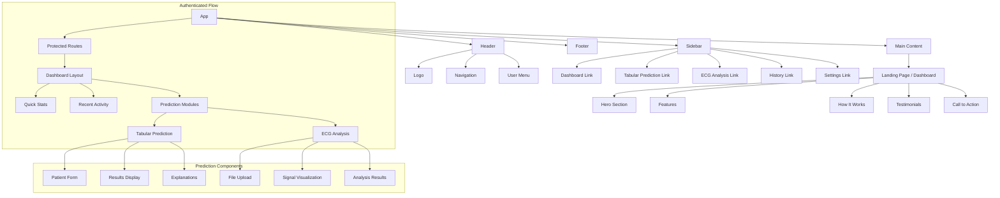
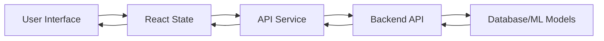

# Frontend Architecture Diagram

## Component Hierarchy



## Data Flow



## Folder Structure

```mermaid
graph TB
    A[frontend/] --> B[public/]
    A --> C[src/]
    
    C --> D[components/]
    C --> E[lib/]
    C --> F[hooks/]
    C --> G[contexts/]
    C --> H[styles/]
    C --> I[services/]
    
    D --> J[ui/]
    D --> K[layout/]
    D --> L[auth/]
    D --> M[dashboard/]
    D --> N[predictions/]
    
    J --> J1[Button]
    J --> J2[Card]
    J --> J3[Input]
    J --> J4[Select]
    J --> J5[Dialog]
    J --> J6[Toast]
    
    K --> K1[Header]
    K --> K2[Sidebar]
    K --> K3[Footer]
    K --> K4[Layout]
    
    L --> L1[LoginForm]
    L --> L2[RegisterForm]
    L --> L3[AuthCard]
    
    M --> M1[DashboardStats]
    M --> M2[ActivityFeed]
    M --> M3[QuickActions]
    
    N --> N1[TabularForm]
    N --> N2[EcgUploader]
    N --> N3[ResultDisplay]
    N --> N4[Visualization]