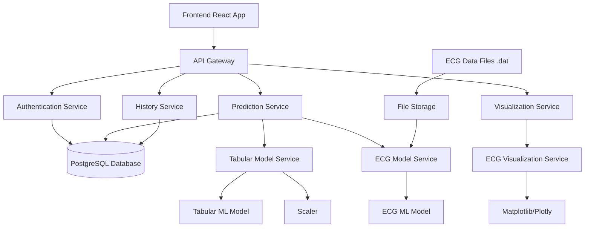
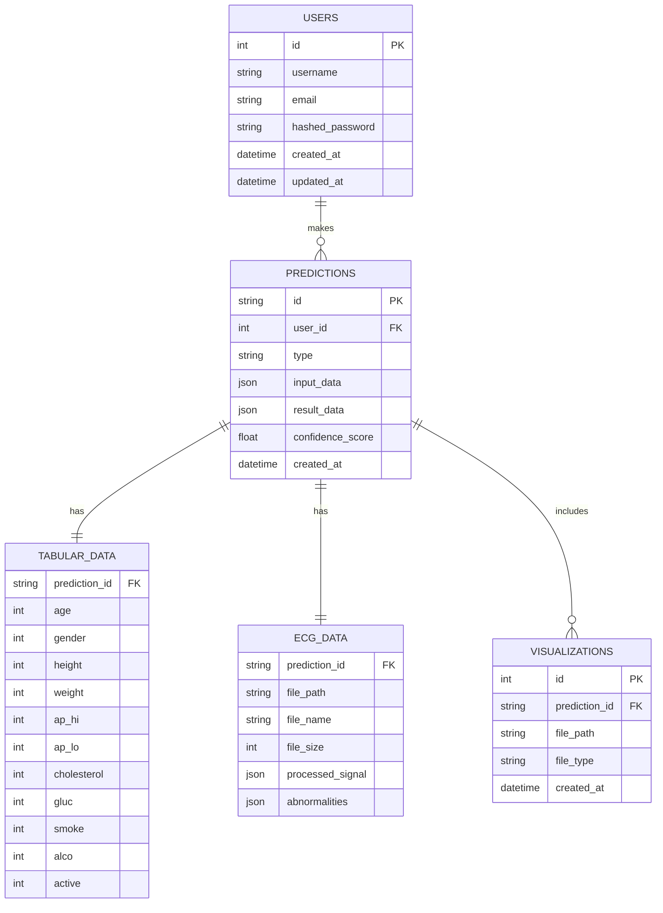

# Cardiovascular Disease Prediction System - Technical Specification

## 1. Overview

This document provides a comprehensive technical specification for the Cardiovascular Disease Prediction System, which integrates machine learning models for both tabular patient data and ECG signal analysis to predict cardiovascular risks and detect arrhythmias.

## 2. System Architecture

### 2.1 High-Level Architecture



### 2.2 Technology Stack

| Layer | Technology |
|-------|------------|
| Frontend | React.js, JavaScript |
| Backend | FastAPI (Python) |
| Database | PostgreSQL |
| ML Frameworks | TensorFlow/Keras, Scikit-learn, SHAP |
| Visualization | Plotly.js, Matplotlib |
| Deployment | Docker, Docker Compose |
| API Documentation | Swagger/OpenAPI |

## 3. Data Models

### 3.1 Input Data

#### Tabular Patient Data
- Age (years)
- Gender (Male/Female)
- Height (cm)
- Weight (kg)
- Systolic Blood Pressure
- Diastolic Blood Pressure
- Cholesterol Level (Normal/Above Normal/Well Above Normal)
- Glucose Level (Normal/Above Normal/Well Above Normal)
- Smoking Status (Yes/No)
- Alcohol Intake (Yes/No)
- Physical Activity (Yes/No)

#### ECG Signal Data
- File format: .dat (PhysioNet standard)
- Sampling rate: 360 Hz
- Duration: Variable (typically 30 minutes)
- Leads: Single or multiple leads

### 3.2 Output Data

#### Tabular Prediction Results
- Risk Level (Low/High)
- Probability Score (0.0-1.0)
- Confidence Score (0.0-1.0)
- Feature Importance Analysis
- Personalized Recommendations

#### ECG Prediction Results
- Arrhythmia Classification
- Class Probabilities
- Confidence Score (0.0-1.0)
- Abnormality Localization
- Signal Quality Assessment
- Clinical Recommendations

## 4. API Specification

### 4.1 Authentication Endpoints

#### POST /auth/register
Registers a new user account

**Request:**
```json
{
  "username": "string",
  "email": "string",
  "password": "string"
}
```

**Response:**
```json
{
  "id": "integer",
  "username": "string",
  "email": "string",
  "created_at": "datetime"
}
```

#### POST /auth/login
Authenticates user and returns access token

**Request:**
```json
{
  "username": "string",
  "password": "string"
}
```

**Response:**
```json
{
  "access_token": "string",
  "token_type": "string",
  "user_id": "integer"
}
```

### 4.2 Prediction Endpoints

#### POST /predict/tabular
Submits patient data for cardiovascular disease prediction

**Headers:**
```
Authorization: Bearer <token>
Content-Type: application/json
```

**Request:**
```json
{
  "age": "integer",
  "gender": "integer",
  "height": "integer",
  "weight": "integer",
  "ap_hi": "integer",
  "ap_lo": "integer",
  "cholesterol": "integer",
  "gluc": "integer",
  "smoke": "integer",
  "alco": "integer",
  "active": "integer"
}
```

**Response:**
```json
{
  "prediction_id": "string",
  "risk_level": "string",
  "probability": "number",
  "confidence": "number",
  "explanation": {
    "summary": "string",
    "feature_importance": [
      {
        "feature": "string",
        "importance": "number"
      }
    ],
    "recommendations": ["string"]
  },
  "created_at": "datetime"
}
```

#### POST /predict/ecg
Uploads ECG file for arrhythmia detection

**Headers:**
```
Authorization: Bearer <token>
Content-Type: multipart/form-data
```

**Form Data:**
```
file: ECG data file (.dat)
```

**Response:**
```json
{
  "prediction_id": "string",
  "result": "string",
  "classification": "string",
  "probabilities": {
    "normal": "number",
    "afib": "number",
    "pvc": "number",
    "other": "number"
  },
  "confidence": "number",
  "explanation": {
    "summary": "string",
    "abnormal_segments": [
      {
        "start_time": "number",
        "end_time": "number",
        "description": "string"
      }
    ],
    "recommendations": ["string"]
  },
  "visualization_url": "string",
  "created_at": "datetime"
}
```

### 4.3 Visualization Endpoints

#### GET /ecg/{prediction_id}/visualization
Retrieves ECG signal visualization

**Headers:**
```
Authorization: Bearer <token>
```

**Response:**
```
Returns PNG image of ECG signal with highlighted abnormalities
```

### 4.4 History Endpoints

#### GET /history
Retrieves user's prediction history

**Headers:**
```
Authorization: Bearer <token>
```

**Query Parameters:**
```
limit: integer (default: 10)
offset: integer (default: 0)
type: string (optional: "tabular" or "ecg")
```

**Response:**
```json
{
  "predictions": [
    {
      "id": "string",
      "type": "string",
      "result": "string",
      "confidence": "number",
      "created_at": "datetime"
    }
  ],
  "total": "integer"
}
```

## 5. Database Schema

### 5.1 Entity Relationship Diagram



### 5.2 Table Definitions

#### Users Table
| Column | Type | Constraints | Description |
|--------|------|-------------|-------------|
| id | SERIAL | PRIMARY KEY | Unique user identifier |
| username | VARCHAR(50) | UNIQUE, NOT NULL | User's chosen username |
| email | VARCHAR(100) | UNIQUE, NOT NULL | User's email address |
| hashed_password | VARCHAR(100) | NOT NULL | Hashed password |
| created_at | TIMESTAMP | DEFAULT NOW() | Account creation timestamp |
| updated_at | TIMESTAMP | DEFAULT NOW() | Last update timestamp |

#### Predictions Table
| Column | Type | Constraints | Description |
|--------|------|-------------|-------------|
| id | UUID | PRIMARY KEY | Unique prediction identifier |
| user_id | INTEGER | FOREIGN KEY (users.id) | Reference to user |
| type | VARCHAR(20) | NOT NULL | Prediction type: 'tabular' or 'ecg' |
| input_data | JSON | NOT NULL | Original input data |
| result_data | JSON | NOT NULL | Complete prediction result |
| confidence_score | FLOAT | NOT NULL | Confidence level (0.0 - 1.0) |
| created_at | TIMESTAMP | DEFAULT NOW() | Prediction creation timestamp |

## 6. Machine Learning Models

### 6.1 Tabular Model (best_tabular_model.pkl)
- **Type**: Gradient Boosting Classifier or Random Forest
- **Input Features**: 11 patient attributes
- **Output**: Binary classification (cardiovascular disease risk)
- **Additional Outputs**: Feature importance for explanations

### 6.2 ECG Model (best_ecg_model.h5)
- **Type**: Deep Convolutional Neural Network
- **Input**: Processed ECG signals
- **Output**: Multi-class arrhythmia classification
- **Additional Outputs**: Attention weights for visualization

### 6.3 Preprocessing Components
- **Tabular Scaler** (tabular_scaler.pkl): Standardizes numerical features
- **ECG Preprocessor**: Filters and normalizes ECG signals

## 7. Confidence and Explanation System

### 7.1 Confidence Calculation

#### Tabular Model Confidence
- Primary: Prediction probability distance from 0.5
- Secondary: Feature stability analysis
- Final: Weighted combination of metrics

#### ECG Model Confidence
- Primary: Maximum class probability
- Secondary: Signal quality assessment
- Final: Adjusted confidence based on signal metrics

### 7.2 Explanation Generation

#### Tabular Explanations
- **SHAP Values**: Quantitative feature importance
- **Natural Language**: Human-readable summary
- **Risk Factors**: Positive and protective contributors
- **Recommendations**: Personalized action items

#### ECG Explanations
- **Abnormality Detection**: Localization and classification
- **Clinical Context**: Prevalence and severity information
- **Signal Quality**: Noise and artifact assessment
- **Recommendations**: Medical follow-up suggestions

## 8. Visualization Components

### 8.1 ECG Signal Visualization

#### Core Features
- Interactive waveform display
- Time navigation (pan/zoom)
- Abnormality highlighting
- Multi-lead support
- Export capabilities

#### Technical Implementation
- **Library**: Plotly.js for React
- **Performance**: Virtualization for large datasets
- **Responsiveness**: Adaptive to screen sizes
- **Accessibility**: Keyboard navigation support

### 8.2 Data Visualization

#### Tabular Data Insights
- Risk factor distribution charts
- Historical prediction trends
- Population comparison graphs

## 9. Security Considerations

### 9.1 Authentication
- JWT-based token authentication
- Password hashing with bcrypt
- Session management

### 9.2 Data Protection
- Encryption at rest for sensitive data
- HTTPS encryption in transit
- Role-based access control

### 9.3 Privacy
- HIPAA compliance considerations
- Data anonymization where possible
- User consent for data usage

## 10. Deployment Architecture

### 10.1 Containerization
- Docker images for each service
- Docker Compose for orchestration
- Environment-specific configurations

### 10.2 Infrastructure
- Reverse proxy (Nginx) for load balancing
- SSL termination
- Static file serving for frontend

### 10.3 Scaling
- Horizontal scaling for API services
- Database connection pooling
- Caching for frequently accessed data

## 11. Monitoring and Logging

### 11.1 Application Monitoring
- API response time tracking
- Error rate monitoring
- Resource utilization metrics

### 11.2 Model Monitoring
- Prediction accuracy tracking
- Data drift detection
- Model performance degradation alerts

### 11.3 Logging
- Structured logging for all services
- Audit trails for predictions
- Debug logs for troubleshooting

## 12. Future Enhancements

### 12.1 Advanced ML Features
- Ensemble methods for improved accuracy
- Uncertainty quantification with Bayesian approaches
- Continuous learning from new data

### 12.2 Enhanced User Experience
- Mobile application development
- Real-time ECG monitoring integration
- Personalized dashboard views

### 12.3 Clinical Integration
- HL7/FHIR standard compatibility
- Electronic Health Record (EHR) integration
- Clinical decision support enhancements